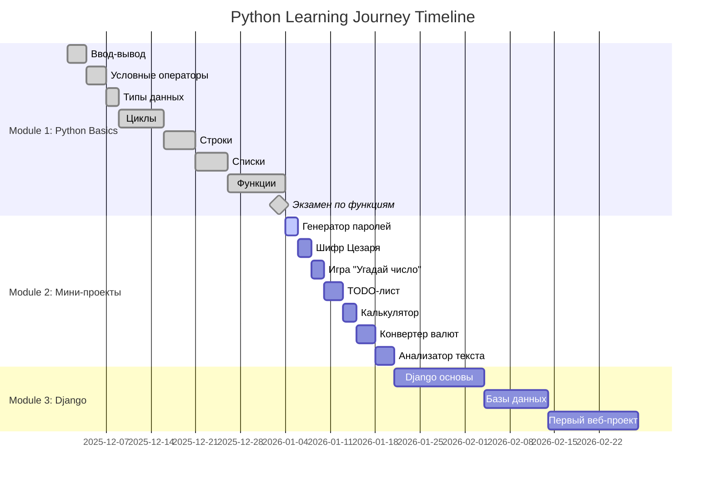

# Python Learning Journey 🐍

[](https://github.com/gen-comf/python_learning_journey)
[](https://opensource.org/licenses/MIT)

  
  

**Мой структурированный путь от основ Python к веб-разработке на Django. Здесь я сохраняю решения задач, учебные проекты и отслеживаю свой прогресс.**

---

## 🎯 СТРАТЕГИЧЕСКИЕ ЦЕЛИ (4-6 МЕСЯЦЕВ)

### ✅ **МЕСЯЦ 1-2: ФУНДАМЕНТ PYTHON — ЗАВЕРШЕНО!**
- **Курс:** «Поколение Python»: курс для начинающих
- **Статус:** ✅ 100% ЗАВЕРШЕНО (03.01.2026)
- **Результат:** 16 модулей, 7 экзаменов, 1500+ задач

### 🔄 **МЕСЯЦ 3-4: DJANGO ОСНОВЫ + БАЗЫ ДАННЫХ**
- Django основы: модели, представления, шаблоны
- Базы данных: SQLite → PostgreSQL
- Создание первого веб-приложения

### ⏳ **МЕСЯЦ 5-6: ПОРТФОЛИО + ПОИСК РАБОТЫ**
- Создание портфолио из 3-4 проектов
- Подготовка к удалённой работе backend-разработчика
- Поиск первых заказов/работы

---

## 🏆 ГЛАВНОЕ ДОСТИЖЕНИЕ: МОДУЛЬ 1 ЗАВЕРШЁН!

**Дата завершения:** 03 января 2026  
**Продолжительность:** ~30 дней  
**Основной курс:** [«Поколение Python»: курс для начинающих](https://stepik.org/course/58852/syllabus)

### 📊 ИТОГОВАЯ СТАТИСТИКА МОДУЛЯ 1:
| Метрика | Результат |
|---------|-----------|
| **Модулей завершено** | 16 из 16 |
| **Экзаменов сдано** | 7 из 7 |
| **Всего задач решено** | 1500+ |
| **Дней обучения** | ~30 дней |
| **Репозиторий коммитов** | 50+ |

---

## 📁 Структура проекта

**python_learning_journey/** - Корневая директория
- **generation_python/** - Решения курса "Поколение Python"
  - **module_1_basics/** - ✅ Основы Python (100% завершено, 16/16 модулей)
    - `input_output/` - Модуль 2-3: Ввод-вывод данных (209+ задач)
    - `conditional_operator/` - Модуль 4-5: Условный оператор (205+ задач)
    - `data_types/` - Модуль 6: Типы данных Python (181+ задач)
    - `loops/` - Модуль 7-8: Циклы while/for (515+ задач)
    - `strings/` - Модуль 9-10: Строки (348+ задач)
    - `lists/` - Модуль 11-12: Списки (368+ задач, list comprehensions)
    - `functions/` - Модуль 13-14: Функции + экзамен (66+ задач) ✅
      - `exam/exam_functions.py` - Финальный экзамен (7 задач)
  - **module_2_projects/** - 🚀 Мини-проекты (Модуль 15, готов к старту)
    - `01_password_generator/` - Проект 1: Генератор паролей
    - `02_caesar_cipher/` - Проект 2: Шифр Цезаря
    - `03_guess_number/` - Проект 3: Игра "Угадай число"
    - `04_todo_cli/` - Проект 4: Консольный TODO-лист
    - `05_simple_calculator/` - Проект 5: Простой калькулятор
    - `06_currency_converter/` - Проект 6: Конвертер валют
    - `07_text_analyzer/` - Проект 7: Анализатор текста
  - **module_3_django/** - 🌐 Веб-разработка (планируется)
    - `django_basics/` - Основы Django: модели, представления, шаблоны
    - `blog_project/` - Первый веб-проект: Блог
    - `portfolio_site/` - Сайт-портфолио
- `README.md` - Этот файл
- `context_reminder.md` - Контекст обучения
- `.gitignore` - Git исключения
- `requirements.txt` - Зависимости Python


## 📊 ПРОГРЕСС КУРСА

### ✅ **МОДУЛЬ 1: ОСНОВЫ PYTHON — 100% ЗАВЕРШЕНО**

| Модуль | Тема | Статус | Задачи | Дата |
|--------|------|--------|--------|------|
| 1 | Общая информация | ✅ | — | 01.12.2025 |
| 2-3 | Ввод-вывод данных | ✅ | 209+ | 03.12.2025 |
| 4-5 | Условный оператор | ✅ | 205+ | 06.12.2025 |
| 6 | Типы данных | ✅ | 181+ | 08.12.2025 |
| 7-8 | Циклы | ✅ | 515+ | 15.12.2025 |
| 9-10 | Строки | ✅ | 348+ | 20.12.2025 |
| 11-12 | Списки | ✅ | 368+ | 25.12.2025 |
| 13-14 | Функции + экзамен | ✅ | 66+ | **03.01.2026** |

---

## 🎯 ПОСЛЕДНИЕ ДОСТИЖЕНИЯ 
*Обновлено: 03 января 2026*

### 🏅 **ВЕХА ДОСТИГНУТА:**
- ✅ **Модуль 1 "Основы Python" полностью завершён!**
- ✅ **Экзамен по функциям успешно сдан** (7/7 задач за 240 минут)
- ✅ **Все 7 итоговых работ курса сданы** (ввод-вывод, условия, циклы, строки, списки, функции)

### 📝 **КЛЮЧЕВЫЕ НАВЫКИ, ОСВОЕННЫЕ В МОДУЛЕ 1:**
1. **Функции** — создание, параметры, возврат значений, область видимости
2. **Списки** — comprehensions, методы, сортировка, сложные операции
3. **Строки** — методы, форматирование, f-строки, работа с индексами
4. **Циклы** — вложенные конструкции, оптимизация, контроль выполнения
5. **Алгоритмы** — базовые алгоритмы сортировки и поиска

### 📁 **ВАЖНЫЕ ФАЙЛЫ И ПРОЕКТЫ:**
- `functions/exam/exam_functions.py` — финальный экзамен (7 задач)
- `functions/06_return_part3/return_part3_practice.py` — продвинутые функции
- `strings/strings_cheatsheet.md` — шпаргалка по строкам
- `lists/lists_cheatsheet.md` — шпаргалка по спискам

---

## 🚀 СЛЕДУЮЩИЙ ЭТАП: МИНИ-ПРОЕКТЫ

### **МОДУЛЬ 15: 7 ПРАКТИЧЕСКИХ ПРОЕКТОВ** (готов к старту)

| # | Проект | Навыки | Сложность | Статус |
|---|--------|--------|-----------|--------|
| 1 | **Генератор паролей** | Случайность, строки, функции | ⭐☆☆☆☆ | ⏳ Ожидает |
| 2 | **Шифр Цезаря** | Алгоритмы, строки, шифрование | ⭐⭐☆☆☆ | ⏳ Ожидает |
| 3 | **Игра "Угадай число"** | Циклы, случайность, логика | ⭐☆☆☆☆ | ⏳ Ожидает |
| 4 | **Консольный TODO-лист** | Списки, файлы, CRUD | ⭐⭐⭐☆☆ | ⏳ Ожидает |
| 5 | **Простой калькулятор** | Функции, обработка ввода | ⭐☆☆☆☆ | ⏳ Ожидает |
| 6 | **Конвертер валют** | API, JSON, обработка данных | ⭐⭐⭐☆☆ | ⏳ Ожидает |
| 7 | **Анализатор текста** | Статистика, строки, файлы | ⭐⭐☆☆☆ | ⏳ Ожидает |

**Цель проектов:** Применить все изученные концепции на практике, создать первое портфолио.

---

## 🛠 ТЕХНОЛОГИЧЕСКИЙ СТЕК

### **ТЕКУЩИЙ:**
- **Язык:** Python 3.x
- **IDE:** VS Code
- **Контроль версий:** Git + GitHub
- **ОС:** Windows + Git Bash
- **Курс:** Stepik «Поколение Python»

### **ПЛАНИРУЕМЫЙ:**
- **Веб-фреймворк:** Django
- **Базы данных:** SQLite → PostgreSQL
- **Деплой:** Render / PythonAnywhere
- **Дополнительно:** Docker, REST API, Celery

---

## 📚 РЕСУРСЫ И ССЫЛКИ

### 🔗 **ОСНОВНЫЕ РЕСУРСЫ:**
- **[«Поколение Python»: курс для начинающих](https://stepik.org/course/58852/syllabus)** — основной учебный курс (✅ завершён)
- **[Репозиторий проекта](https://github.com/gen-comf/python_learning_journey)** — полная история обучения
- **[Профиль GitHub](https://github.com/gen-comf)** — мои проекты и активность
- **[Stepik профиль](https://stepik.org/users/your-profile)** — сертификаты и прогресс

### 📖 **ДОКУМЕНТАЦИЯ:**
- [Официальная документация Python](https://docs.python.org/3/)
- [Django Documentation](https://docs.djangoproject.com/) — для будущего изучения
- [Git Handbook](https://guides.github.com/introduction/git-handbook/) — работа с Git

---

## 📈 ДИАГРАММА ГАНТТА (ОБНОВЛЕНА)


---

## 🎉 ЦЕРЕМОНИЯ ЗАВЕРШЕНИЯ МОДУЛЯ 1

```python
def celebrate_achievement():
    print("=" * 60)
    print("🎉 МОДУЛЬ 1 'ОСНОВЫ PYTHON' УСПЕШНО ЗАВЕРШЁН! 🎉")
    print("=" * 60)
    print()
    print("📊 Статистика достижений:")
    print(f"  • Модулей завершено: 16/16")
    print(f"  • Экзаменов сдано: 7/7")
    print(f"  • Задач решено: 1500+")
    print(f"  • Дней обучения: ~30")
    print(f"  • Дата завершения: 03.01.2026")
    print()
    print("🚀 Следующий этап: 7 мини-проектов для портфолио!")
    print("=" * 60)

celebrate_achievement()
```
---

## 📞 КОНТАКТЫ И ОБРАТНАЯ СВЯЗЬ 
   - **GitHub:** [gen-comf](https://github.com/gen-comf)
   - **Репозиторий:** [python_learning_journey](https://github.com/gen-comf/python_learning_journey)
   - **Цель:** Backend разработчик на Python/Django
   - **Статус:** Завершён Модуль 1, перехожу к проектам

Обновлено: 03 января 2026
Текущий статус: ✅ МОДУЛЬ 1 ЗАВЕРШЁН — ПЕРЕХОД К ПРОЕКТАМ
Следующая цель: 🚀 НАЧАТЬ ПЕРВЫЙ МИНИ-ПРОЕКТ "ГЕНЕРАТОР ПАРОЛЕЙ"

"Успех — это движение от неудачи к неудаче без потери энтузиазма."